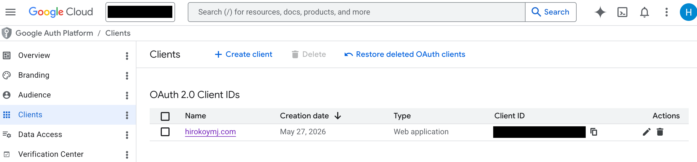

# Auth0

## Auth0

- Auth0 is an easy to implement adaptable authentication and authorization platform.
- What is Auth0 and what problem does it solve? Auth0 is a third-party authentication service. It handles login, signup, and user management so you don't have to build it from scratch.

## Authentication and Authorization

- Q: What is the difference between Authentication and Authorization?
  > Authentication verifies who you are (login). Authorization verifies what you can do (permissions).

## OAuth 2.0 and Google social login

Q: What is OAuth 2.0 and how does Auth0 use it?

- OAuth 2.0 is an authorization framework that lets users grant a third-party app (like yours) access to their account on another service (like Google) without sharing their password.

- Google social login with your own OAuth credentials ✅

**GCP**

1. Go to Google Cloud Console → APIs & Services → Credentials
2. Create an OAuth 2.0 Client ID (Web application type)
3. Add https://YOUR_AUTH0_DOMAIN.auth0.com/login/callback to the Authorized redirect URIs
4. Copy the Client ID and Secret back into the Auth0 Google connection settings

**Google sign-in:**

Click "Login with Auth0" → Auth0 dialog → Click "Continue with Google" → Google account selection → Redirect to /callback → Redirect to /dashboard → Logged in

**Email/password:**

Click "Login with Auth0" → Auth0 dialog → Enter email & password → Click "Continue" → Redirect to /callback → Redirect to /dashboard → Logged in

> The key step both flows share is the /callback route — that's where Auth0 exchanges the authorization code for tokens before redirecting to the dashboard.

User -> Application -> API (Google)

## What is OpenID Connect (OIDC) and how does it differ from OAuth 2.0?

- OIDC is built on top of OAuth 2.0 and adds identity — it issues an id_token (JWT) that contains user profile info. OAuth 2.0 alone only handles authorization, not identity.
