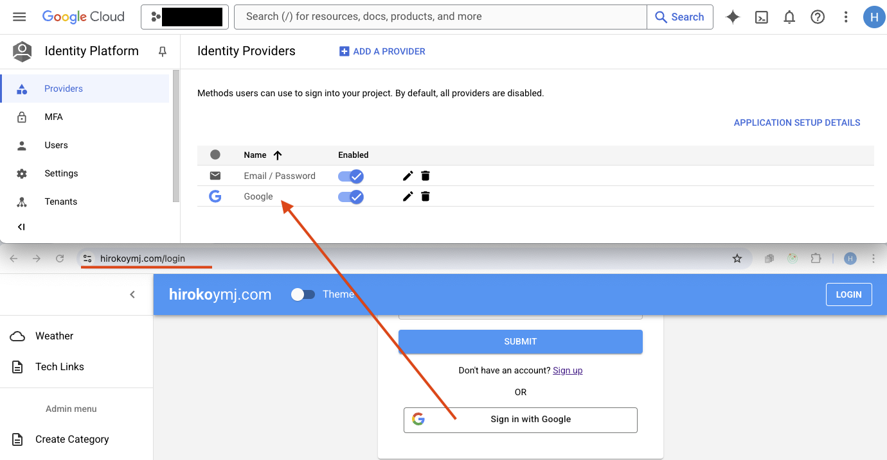
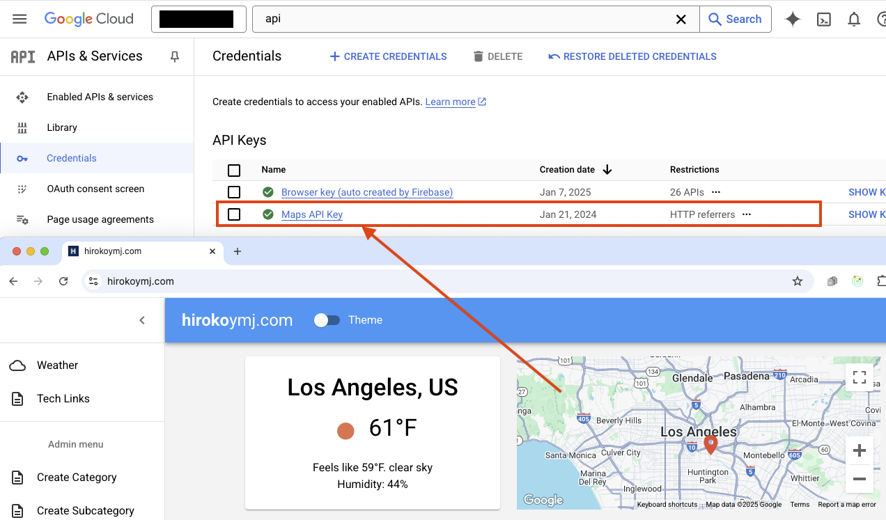

# hirokoymj.com

- Live URL : https://www.hirokoymj.com

## Frontend

React.js (v19), TypeScript, React Hooks/Context, React Router v6, Redux Toolkit, React Hook Form, Weather API, Google Account Sign-in, MUI (Material UI) v7, Gemini 2.5 API

## Backend

Apollo Server v3 (GraphQL), MongoDB Atlas, Mongoose — [Backend API repository](https://github.com/hirokoymj/hirokoymj-backend-vercel)

## Deployment

- **Vercel** — production site at https://www.hirokoymj.com
- **Docker** — containerized image published to GitHub Container Registry via GitHub Actions

<hr />

## Google Cloud (GCP)

**Google Account Authentication**

1. Firebase console -> Add app -> Web -> Add Firebase to your web app -> Authentication -> Add new provider -> Google -> `npm install firebase` -> Copy Firebase config code in your app.
2. GCP console -> Identity Platform -> Providers -> Edit Google -> Add domain (www.hirokoymj.com)
3. [contexts/authContext.tsx](./src/contexts/authContext.tsx)



<hr />

**Google Map Implementation**

- GCP console -> APIs & Services -> Enable `Maps JavaScript API` -> Add key in the component `<GoogleMapReact bootstrapURLKeys={{ key: "" }}>`

```js
$gcloud services list --enabled
maps-backend.googleapis.com                  Maps JavaScript API
```



## CI/CD and Docker

This project uses **GitHub Actions** to automatically build and publish a Docker image to **GitHub Container Registry (ghcr.io)** on every push to `main` or a new version tag.

**Pipeline steps:**

1. Checkout the repository
2. Log in to GitHub Container Registry
3. Build a Docker image using a multi-stage `Dockerfile`
   - **Stage 1 (builder):** Installs dependencies with `npm ci` and builds the app with `npm run build`
   - **Stage 2 (production):** Serves the built `dist/` folder using `serve`
4. Push the image to `ghcr.io/hirokoymj/hirokoymj-vercel`

**Dockerfile:** [Dockerfile](./Dockerfile)  
**Workflow:** [.github/workflows/docker-publish.yml](./.github/workflows/docker-publish.yml)

### Packages and Releases

Pull and run the latest image:

```bash
docker pull --platform linux/amd64 ghcr.io/hirokoymj/hirokoymj-vercel:main
docker run --platform linux/amd64 -p 3000:3000 ghcr.io/hirokoymj/hirokoymj-vercel:main
```

Pull a specific release version:

```bash
docker pull --platform linux/amd64 ghcr.io/hirokoymj/hirokoymj-vercel:v1.0.0
docker run --platform linux/amd64 -p 3000:3000 ghcr.io/hirokoymj/hirokoymj-vercel:v1.0.0
```

Open `http://localhost:3000` in your browser.

## References

**React.js**

- [Built-in React Hooks](https://react.dev/reference/react/hooks)
- [React API - CreateContext](https://react.dev/reference/react/createContext)
- [React API - memo](https://react.dev/reference/react/memo)
- [React TypeScript cheetsheet](https://react-typescript-cheatsheet.netlify.app/docs/basic/examples/)

**React Router**

- [React Router - useParams](https://reactrouter.com/6.30.1/hooks/use-params)
- [React Router - createRoutesFromElements](https://reactrouter.com/6.30.1/utils/create-routes-from-elements)

**React Hook Form**

- [React Hook Form](https://react-hook-form.com/)
- [React Hook Form Typescript](https://react-hook-form.com/ts)

**Redux**

- [Redux Toolkit Quikc Start/Install](https://redux-toolkit.js.org/tutorials/quick-start)
- [TypeScript with Apollo Client](https://www.apollographql.com/docs/react/development-testing/static-typing)

**Apollo Client**

- [Queries](https://www.apollographql.com/docs/react/data/queries)
- [Mutations](https://www.apollographql.com/docs/react/data/mutations)

**GCP Cloud library**

- [GCP Signing in user with Google](https://cloud.google.com/identity-platform/docs/web/google)

**Build tool Vite(Veet)**

- https://vite.dev/guide/
- [Migrating from Create React App to Vite:](https://adhithiravi.medium.com/migrating-from-create-react-app-to-vite-a-modern-approach-76148adb8983)
- [How to use process.env in Vite](https://dev.to/whchi/how-to-use-processenv-in-vite-ho9)

**Material UI**

- [Material UI v7](https://mui.com/material-ui/getting-started/)

**Google Gemini API Docs**

- https://ai.google.dev/gemini-api/docs/function-calling?example=weather
