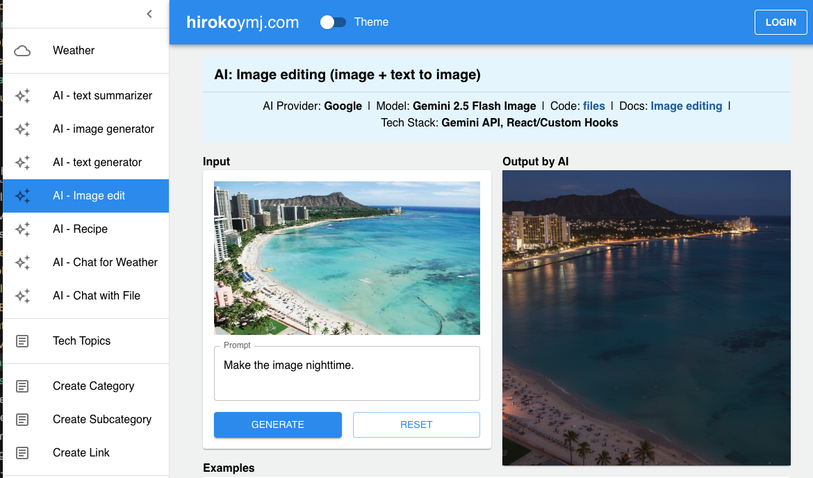
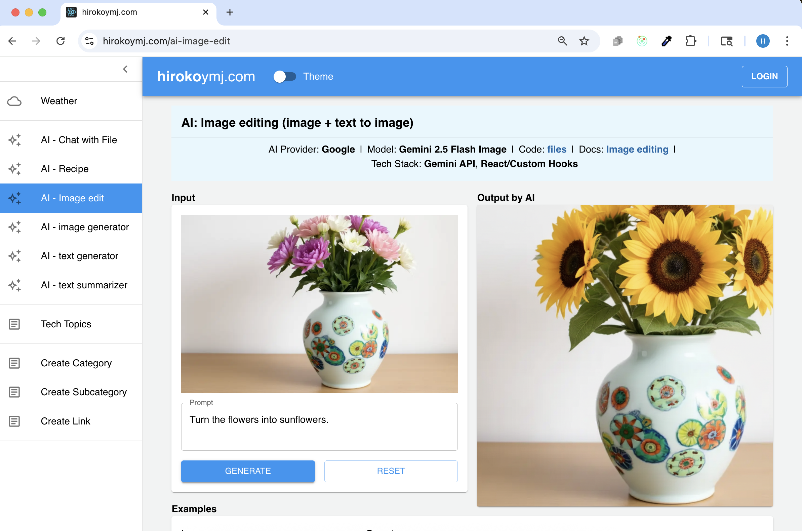

# AI: Image editing

**Live URL:**
https://www.hirokoymj.com/ai-image-edit

**Tech Stack**

- AI Provider: Gemini
- Model name: Gemini 2.5 Flash Image
- Skills used:
  - Gemini API
  - React
  - React custom hook
  - MUI
- Gemini API docs:
  - [Image editing (text-and-image-to-image)](https://ai.google.dev/gemini-api/docs/image-generation#gemini-image-editing)
  - [Gemini 2.5 Flash Image](https://ai.google.dev/gemini-api/docs/models#gemini-2.
  - 5-flash-image)
  - [FileReader](https://developer.mozilla.org/en-US/docs/Web/API/FileReader)

**Screnshot**

