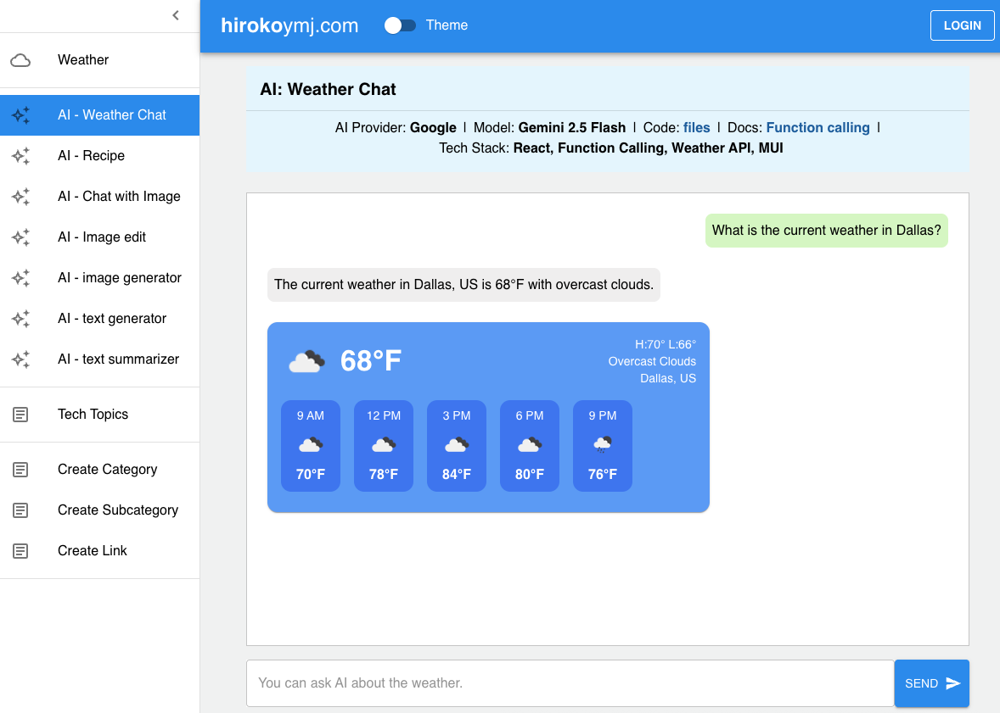

# AI: Chat for weather

**Live URL:**
https://www.hirokoymj.com/ai-weather

**Tech Stack**

- AI Provider: Gemini
- Model name: Gemini 2.5 Flash-Lite
- Skills used:
  - React
  - Gemini API (Function calling, Chat)
  - Weather API
  - MUI
  - Heroku Cloud
- Gemini API docs:
  - [Function Calling](https://ai.google.dev/gemini-api/docs/function-calling?example=weather)
  - [Gemini 2.5 Flash-Lite](https://ai.google.dev/gemini-api/docs/models#gemini-2.5-flash-lite)

**Screnshot**

